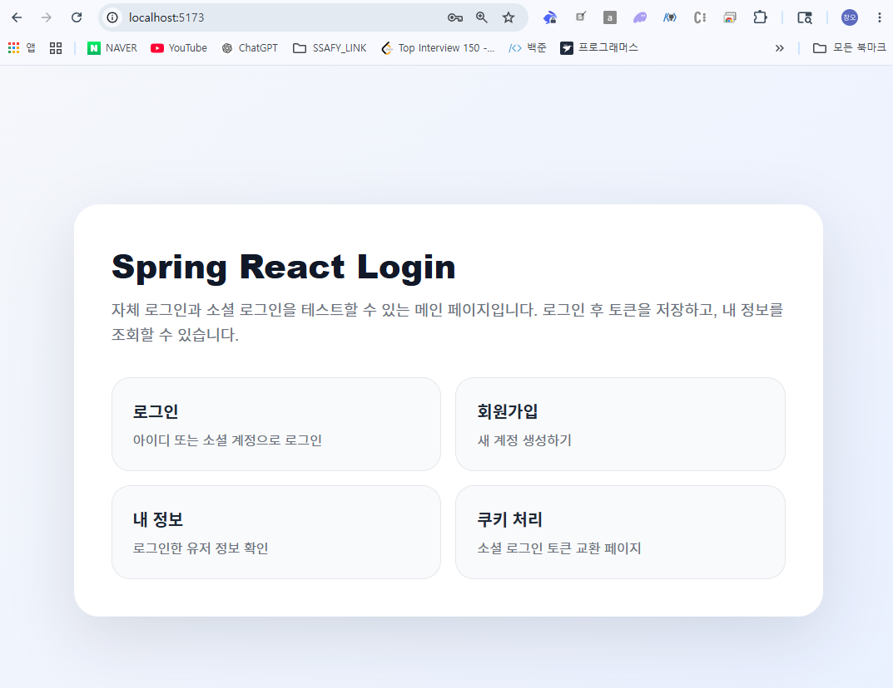
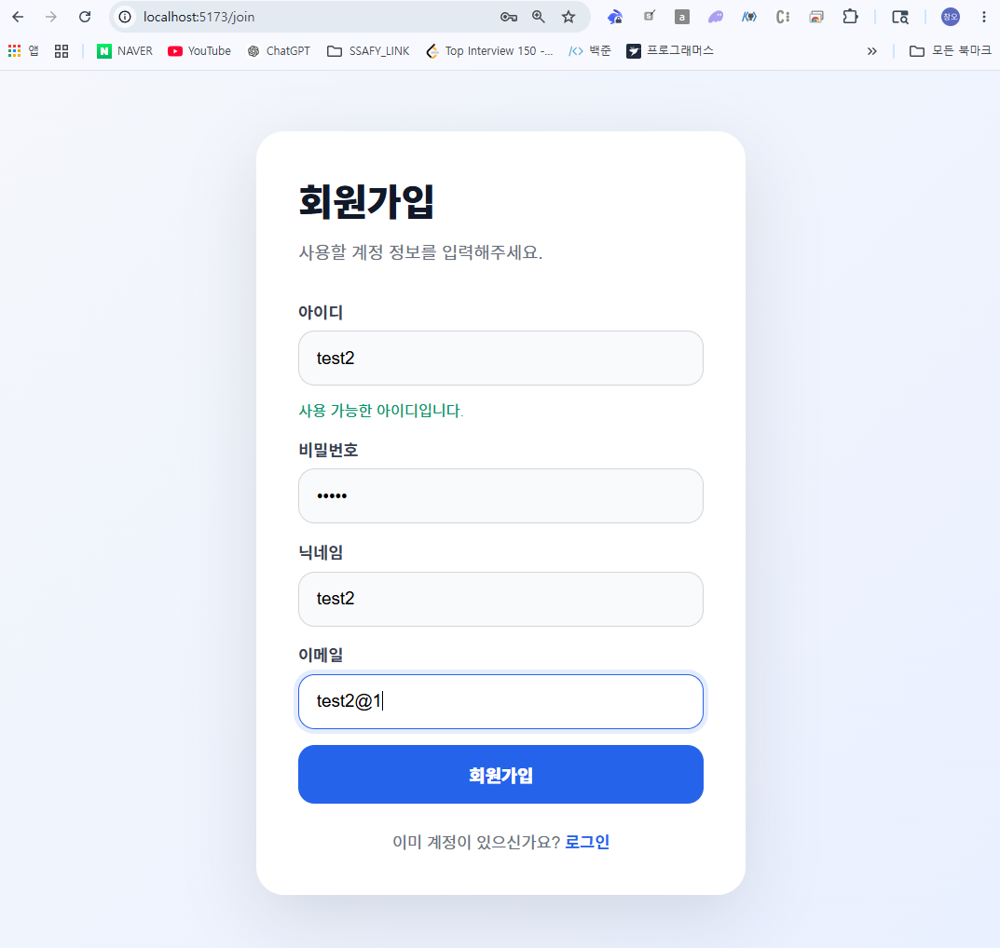
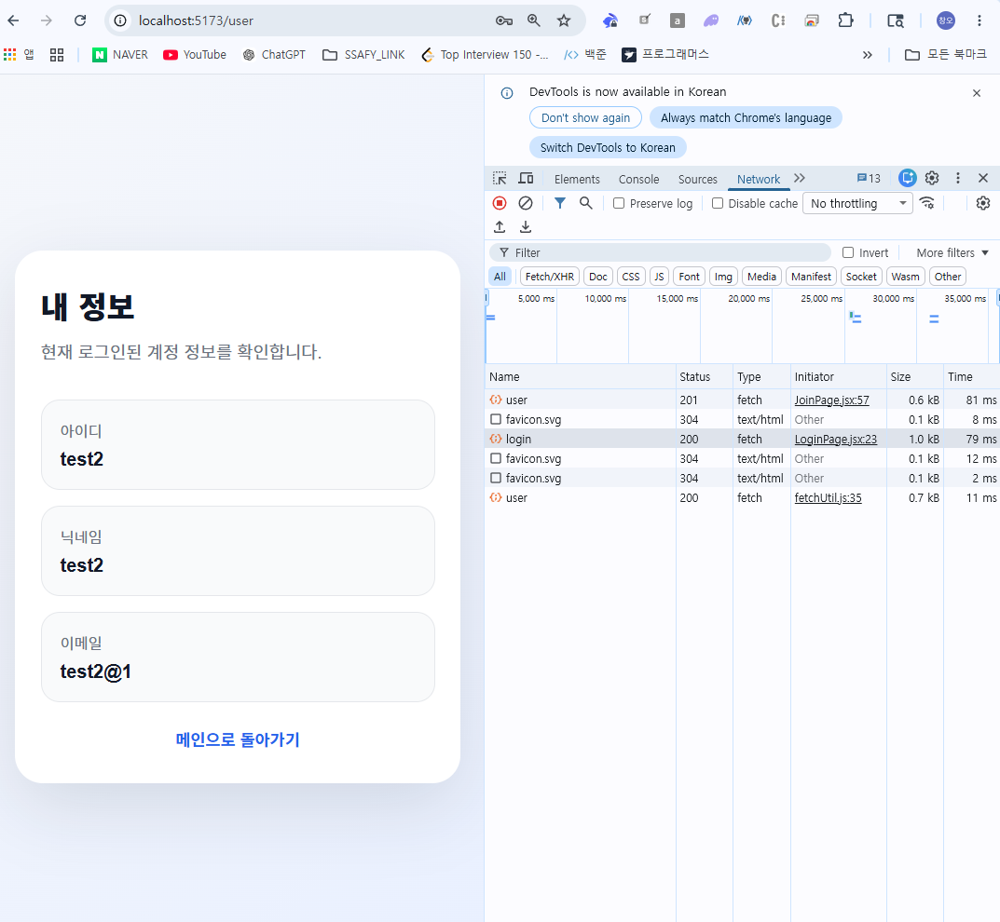
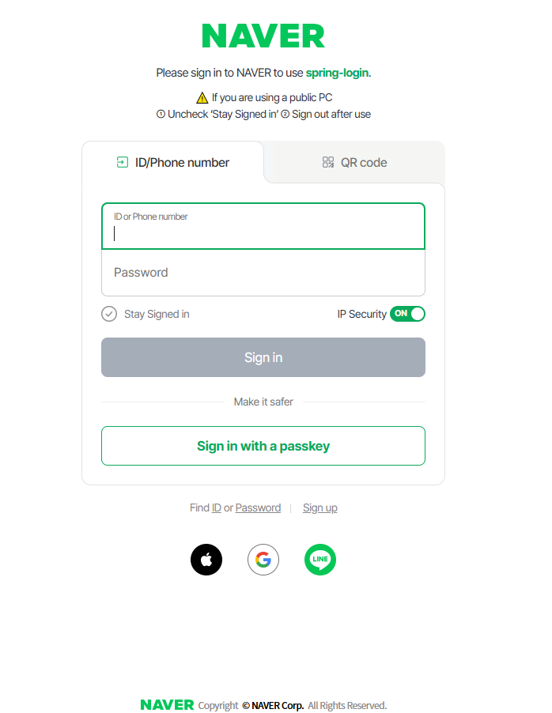
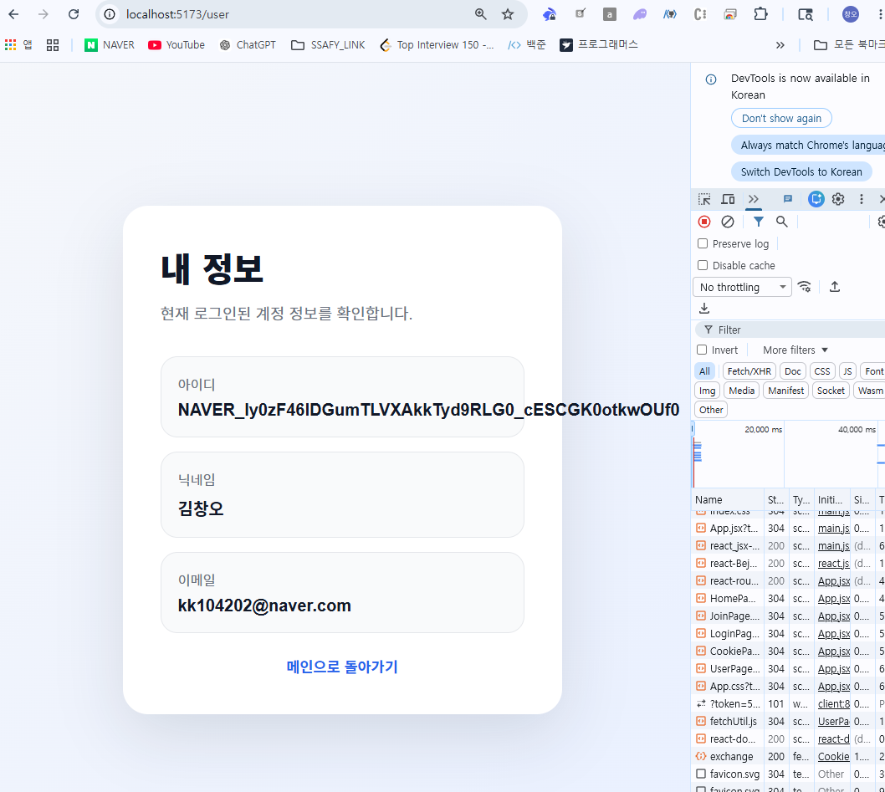

# Spring Boot + React 로그인 구현 스터디

Spring Boot와 React를 사용하여 자체 로그인, 회원가입, JWT 인증, Refresh Token 관리, 네이버 OAuth2 소셜 로그인까지 구현한 로그인 학습 프로젝트입니다.

이번 프로젝트의 핵심 목표는 단순히 로그인 화면을 만드는 것이 아니라, 백엔드에서 로그인 요청이 어떤 필터를 거쳐 처리되고, 사용자 정보가 어떻게 조회되며, 인증 성공 후 JWT가 어떻게 발급되고, 이후 요청에서 어떻게 인증 상태를 유지하는지 전체 흐름을 이해하는 것입니다.

---

## 1. 프로젝트 개요

이 프로젝트는 프론트엔드와 백엔드를 분리한 구조로 구성되어 있습니다.

프론트엔드는 React로 구성되어 있으며, 회원가입 화면, 로그인 화면, 쿠키 처리 화면, 내 정보 조회 화면을 담당합니다.

백엔드는 Spring Boot로 구성되어 있으며, 회원가입, 자체 로그인, OAuth2 로그인, JWT 발급, Refresh Token 저장 및 재발급, 인증된 사용자 정보 조회를 담당합니다.

---

## 2. 주요 기능

### 자체 회원가입

사용자는 아이디, 비밀번호, 닉네임, 이메일을 입력하여 회원가입할 수 있습니다.

회원가입 시 아이디 중복 검사를 먼저 수행합니다. 중복 검사는 프론트엔드에서 입력값이 변경될 때 일정 시간 지연 후 백엔드 API를 호출하는 방식으로 구현했습니다.

### 자체 로그인

사용자는 아이디와 비밀번호로 로그인할 수 있습니다.

로그인 요청은 Spring Security의 기본 Form Login을 사용하지 않고, 직접 구현한 `LoginFilter`에서 처리합니다.

로그인에 성공하면 `LoginSuccessHandler`가 실행되고, Access Token과 Refresh Token을 발급하여 클라이언트에 반환합니다.

### 네이버 OAuth2 로그인

네이버 계정을 사용한 소셜 로그인을 구현했습니다.

사용자가 프론트엔드에서 네이버 로그인 버튼을 누르면 백엔드의 OAuth2 인증 시작 URL로 이동합니다.

이후 Spring Security OAuth2 Client가 네이버 인증 서버로 사용자를 리다이렉트하고, 로그인 성공 후 백엔드 콜백 URL로 돌아옵니다.

백엔드는 네이버에서 받은 사용자 정보를 기반으로 기존 회원을 조회하거나 신규 소셜 회원을 생성합니다.

### JWT 인증

로그인 성공 시 Access Token과 Refresh Token을 발급합니다.

Access Token은 이후 API 요청 시 인증 정보로 사용됩니다.

Refresh Token은 DB에 저장되며, Access Token이 만료되었을 때 재발급에 사용됩니다.

### 내 정보 조회

로그인 후 사용자는 자신의 회원 정보를 조회할 수 있습니다.

프론트엔드는 저장된 Access Token을 사용하여 `/user` API를 호출하고, 백엔드는 JWT 인증 필터를 통해 사용자를 식별한 뒤 사용자 정보를 반환합니다.

---

## 3. 실행 화면

### 첫 화면



### 회원가입 화면



### 자체 로그인 후 내 정보 확인 화면



### 네이버 로그인 화면으로 이동



### 네이버 로그인 후 회원정보 확인 화면



---

## 4. 프로젝트 구조

### 4-1. 백엔드 구조

```text
backend
└─ src
   └─ main
      └─ java
         └─ org.example.backend
            ├─ api
            │  ├─ CustomControllerAdvice
            │  ├─ JwtController
            │  └─ UserController
            │
            ├─ config
            │  ├─ JpaAuditingConfig
            │  ├─ MyConfig
            │  ├─ ScheduleConfig
            │  └─ SecurityConfig
            │
            ├─ domain
            │  ├─ jwt
            │  │  ├─ dto
            │  │  │  ├─ JWTResponseDTO
            │  │  │  └─ RefreshRequestDTO
            │  │  ├─ entity
            │  │  │  └─ RefreshEntity
            │  │  ├─ repository
            │  │  │  └─ RefreshRepository
            │  │  └─ service
            │  │     └─ JwtService
            │  │
            │  └─ user
            │     ├─ dto
            │     │  ├─ CustomOAuth2User
            │     │  ├─ UserRequestDTO
            │     │  └─ UserResponseDTO
            │     ├─ entity
            │     │  ├─ SocialProviderType
            │     │  ├─ UserEntity
            │     │  └─ UserRoleType
            │     ├─ repository
            │     │  └─ UserRepository
            │     └─ service
            │        └─ UserService
            │
            ├─ filter
            │  ├─ JWTFilter
            │  └─ LoginFilter
            │
            ├─ handler
            │  ├─ LoginSuccessHandler
            │  ├─ RefreshTokenLogoutHandler
            │  └─ SocialSuccessHandler
            │
            ├─ util
            │  └─ JWTUtil
            │
            └─ BackendApplication
```

### 4-2. 프론트엔드 구조

```text
frontend
├─ src
│  ├─ assets
│  ├─ pages
│  │  ├─ CookiePage.jsx
│  │  ├─ HomePage.jsx
│  │  ├─ JoinPage.jsx
│  │  ├─ LoginPage.jsx
│  │  └─ UserPage.jsx
│  ├─ util
│  │  └─ fetchUtil.js
│  ├─ App.css
│  ├─ App.jsx
│  ├─ index.css
│  └─ main.jsx
│
├─ .env
├─ package.json
└─ vite.config.js
```

---

## 5. 백엔드 핵심 구조 설명

이번 프로젝트의 핵심은 백엔드에서 인증과 인가 흐름을 직접 구성한 부분입니다.

Spring Security를 사용했지만 기본 로그인 화면이나 기본 Form Login 방식을 그대로 사용하지 않았습니다.

대신 다음과 같은 방식으로 직접 로그인 구조를 구성했습니다.

```text
사용자 요청
→ SecurityFilterChain
→ LoginFilter 또는 JWTFilter 또는 OAuth2LoginFilter
→ UserService
→ Repository
→ DB
→ SuccessHandler
→ JWT 발급
→ 프론트엔드 응답
```

---

## 6. api 패키지

`api` 패키지는 클라이언트가 직접 호출하는 Controller 계층입니다.

프론트엔드의 React 화면에서 발생한 HTTP 요청은 가장 먼저 이 Controller 계층으로 들어옵니다.

### UserController

회원가입, 아이디 중복 확인, 내 정보 조회, 회원 정보 수정, 회원 탈퇴와 같은 사용자 관련 API를 담당합니다.

주요 역할은 다음과 같습니다.

```text
회원가입 요청 수신
아이디 중복 확인 요청 수신
로그인한 사용자 정보 조회 요청 수신
회원 정보 수정 요청 수신
회원 탈퇴 요청 수신
```

직접 비즈니스 로직을 처리하지 않고, `UserService`에 처리를 위임합니다.

예를 들어 회원가입 요청이 들어오면 `UserController`는 요청 DTO를 받아 `UserService.addUser()`를 호출합니다.

```text
React JoinPage
→ POST /user
→ UserController
→ UserService
→ UserRepository
→ DB 저장
```

### JwtController

JWT 재발급과 소셜 로그인 이후 쿠키에 담긴 토큰을 응답 바디로 교환하는 역할을 담당합니다.

소셜 로그인은 브라우저 리다이렉트 기반으로 동작하기 때문에, 백엔드가 토큰을 바로 JSON 응답으로 내려주기 어렵습니다.

그래서 소셜 로그인 성공 후 백엔드는 토큰을 쿠키에 담아 프론트엔드의 `/cookie` 페이지로 리다이렉트합니다.

이후 React의 `CookiePage`가 `/jwt/exchange` API를 호출하여 쿠키에 있던 토큰을 응답 바디로 받아 `localStorage`에 저장합니다.

```text
네이버 로그인 성공
→ SocialSuccessHandler
→ 토큰 쿠키 저장
→ React /cookie 이동
→ CookiePage
→ POST /jwt/exchange
→ JwtController
→ Access Token / Refresh Token 응답
→ localStorage 저장
```

### CustomControllerAdvice

전역 예외 처리를 담당하는 클래스입니다.

Controller 또는 Service에서 발생하는 예외를 한 곳에서 처리할 수 있도록 도와줍니다.

이 클래스를 사용하면 각 Controller마다 반복적으로 try-catch를 작성하지 않아도 됩니다.

---

## 7. config 패키지

`config` 패키지는 프로젝트 전반의 설정을 담당합니다.

이 프로젝트에서 가장 중요한 설정 클래스는 `SecurityConfig`입니다.

### SecurityConfig

`SecurityConfig`는 Spring Security의 전체 인증/인가 흐름을 정의하는 핵심 클래스입니다.

이 클래스에서 다음 내용을 설정합니다.

```text
CSRF 비활성화
CORS 설정
Form Login 비활성화
HTTP Basic 비활성화
OAuth2 Login 설정
URL별 접근 권한 설정
JWTFilter 등록
LoginFilter 등록
세션 정책 설정
로그아웃 핸들러 설정
```

### CSRF 비활성화

```java
http.csrf(AbstractHttpConfigurer::disable);
```

이 프로젝트는 세션 기반 로그인보다는 JWT 기반 인증 방식을 사용합니다.

JWT 기반 구조에서는 일반적으로 CSRF 공격 위험이 기존 세션 로그인 방식보다 낮기 때문에 CSRF를 비활성화했습니다.

### CORS 설정

프론트엔드는 `localhost:5173`, 백엔드는 `localhost:8080`에서 실행됩니다.

서로 포트가 다르기 때문에 브라우저 입장에서는 다른 Origin으로 판단합니다.

그래서 백엔드에서 React 개발 서버의 요청을 허용해주어야 합니다.

```java
configuration.setAllowedOrigins(List.of("http://localhost:5173"));
configuration.setAllowedMethods(List.of("GET", "POST", "PUT", "DELETE", "OPTIONS"));
configuration.setAllowedHeaders(List.of("*"));
configuration.setAllowCredentials(true);
configuration.setExposedHeaders(List.of("Authorization", "Set-Cookie"));
```

`setAllowCredentials(true)`는 쿠키를 포함한 요청을 허용하기 위해 필요합니다.

소셜 로그인 후 토큰을 쿠키로 전달하고, React에서 `credentials: "include"`로 요청하기 때문에 반드시 필요한 설정입니다.

### Form Login 비활성화

```java
http.formLogin(AbstractHttpConfigurer::disable);
```

Spring Security는 기본적으로 Form Login 기능을 제공합니다.

하지만 이 프로젝트는 React에서 로그인 화면을 직접 만들고, 백엔드에서는 직접 만든 `LoginFilter`가 로그인 요청을 처리합니다.

그래서 기본 Form Login은 사용하지 않습니다.

### HTTP Basic 비활성화

```java
http.httpBasic(AbstractHttpConfigurer::disable);
```

HTTP Basic 인증은 브라우저 기본 인증창을 사용하는 방식입니다.

이 프로젝트에서는 JWT 기반 인증을 사용하므로 HTTP Basic 인증도 비활성화했습니다.

### OAuth2 Login 설정

```java
http.oauth2Login(oauth2 -> oauth2
        .successHandler(socialSuccessHandler));
```

네이버 OAuth2 로그인 성공 후 `SocialSuccessHandler`가 실행되도록 설정했습니다.

즉, 네이버 로그인이 성공하면 바로 끝나는 것이 아니라, 성공 이후 다음 작업을 직접 처리합니다.

```text
네이버 로그인 성공
→ OAuth2 인증 완료
→ UserService.loadUser() 실행
→ DB에 사용자 조회 또는 저장
→ SocialSuccessHandler 실행
→ JWT 발급
→ 프론트엔드로 리다이렉트
```

### URL별 접근 권한 설정

```java
.authorizeHttpRequests(auth -> auth
        .requestMatchers("/jwt/exchange", "/jwt/refresh").permitAll()
        .requestMatchers(HttpMethod.POST, "/user/exist", "/user").permitAll()
        .requestMatchers(HttpMethod.GET, "/user").hasRole(UserRoleType.USER.name())
        .requestMatchers(HttpMethod.PUT, "/user").hasRole(UserRoleType.USER.name())
        .requestMatchers(HttpMethod.DELETE, "/user").hasRole(UserRoleType.USER.name())
        .anyRequest().authenticated()
)
```

회원가입, 아이디 중복 확인, JWT 교환, JWT 재발급은 로그인하지 않은 사용자도 접근할 수 있어야 합니다.

반면 내 정보 조회, 회원 정보 수정, 회원 탈퇴는 로그인한 사용자만 접근할 수 있어야 합니다.

그래서 `/user`의 GET, PUT, DELETE 요청은 USER 권한이 필요하도록 설정했습니다.

### LoginFilter 등록

```java
http.addFilterBefore(
    new LoginFilter(authenticationManager(authenticationConfiguration), loginSuccessHandler),
    UsernamePasswordAuthenticationFilter.class
);
```

`LoginFilter`는 자체 로그인 요청을 처리하는 커스텀 필터입니다.

기본 Spring Security 로그인 필터를 사용하는 대신, 직접 만든 필터를 등록했습니다.

이 필터는 `/login` 요청을 가로채서 사용자가 입력한 username과 password를 검증합니다.

성공하면 `LoginSuccessHandler`가 실행됩니다.

```text
React LoginPage
→ POST /login
→ LoginFilter
→ AuthenticationManager
→ UserService.loadUserByUsername()
→ 비밀번호 검증
→ LoginSuccessHandler
→ JWT 발급
```

### JWTFilter 등록

```java
http.addFilterBefore(new JWTFilter(), LogoutFilter.class);
```

`JWTFilter`는 요청에 포함된 Access Token을 검사하는 필터입니다.

사용자가 로그인 후 `/user` 같은 인증이 필요한 API를 호출하면, 이 필터가 먼저 실행됩니다.

이 필터의 역할은 다음과 같습니다.

```text
요청 헤더에서 Access Token 추출
토큰 유효성 검사
토큰에서 username과 role 추출
Authentication 객체 생성
SecurityContextHolder에 인증 정보 저장
```

즉, 매 요청마다 JWT를 확인해서 현재 사용자가 누구인지 Spring Security에 알려주는 역할을 합니다.

---

## 8. domain.user 패키지

`domain.user` 패키지는 사용자 도메인을 담당합니다.

회원가입, 자체 로그인, 소셜 로그인, 사용자 정보 조회와 관련된 핵심 로직이 이 패키지에 들어 있습니다.

### UserEntity

`UserEntity`는 사용자 정보를 DB에 저장하기 위한 JPA 엔티티입니다.

주요 필드는 다음과 같습니다.

```text
id
username
password
nickname
email
isLock
isSocial
socialProviderType
roleType
createdDate
updatedDate
```

### username

사용자를 식별하는 로그인 ID입니다.

자체 로그인 사용자는 사용자가 직접 입력한 아이디가 username으로 저장됩니다.

소셜 로그인 사용자는 제공자 이름과 제공자 고유 ID를 조합하여 username을 만듭니다.

```text
자체 로그인 사용자: changoh
네이버 로그인 사용자: NAVER_네이버고유ID
구글 로그인 사용자: GOOGLE_구글고유ID
```

이렇게 구분하면 자체 로그인 사용자와 소셜 로그인 사용자가 충돌하지 않습니다.

### password

자체 로그인 사용자의 비밀번호입니다.

비밀번호는 `PasswordEncoder`를 통해 BCrypt 방식으로 암호화하여 저장합니다.

소셜 로그인 사용자는 비밀번호 로그인을 하지 않으므로 빈 문자열로 저장합니다.

### nickname

사용자 닉네임입니다.

자체 회원가입 시 사용자가 입력한 닉네임을 저장합니다.

네이버 로그인 사용자는 네이버에서 받은 이름 정보를 nickname으로 저장합니다.

### email

사용자 이메일입니다.

자체 회원가입 또는 소셜 로그인 제공자로부터 받은 이메일을 저장합니다.

### isLock

계정 잠금 여부입니다.

false이면 정상 계정이고, true이면 잠긴 계정입니다.

### isSocial

자체 로그인 사용자인지 소셜 로그인 사용자인지 구분합니다.

```text
false: 자체 로그인 사용자
true: 소셜 로그인 사용자
```

### socialProviderType

소셜 로그인 제공자를 나타냅니다.

자체 로그인 사용자는 값이 없고, 소셜 로그인 사용자는 NAVER 또는 GOOGLE 같은 값이 들어갑니다.

### roleType

사용자 권한입니다.

기본 회원가입 사용자는 USER 권한을 가집니다.

관리자가 필요한 경우 ADMIN 권한을 줄 수 있습니다.

### UserRoleType

사용자 권한을 enum으로 관리합니다.

```text
USER
ADMIN
```

Spring Security에서는 보통 권한 앞에 `ROLE_` 접두어를 붙여 사용합니다.

그래서 내부적으로는 `ROLE_USER`, `ROLE_ADMIN` 형태로 사용됩니다.

### SocialProviderType

소셜 로그인 제공자를 enum으로 관리합니다.

```text
NAVER
GOOGLE
```

문자열을 직접 비교하면 오타가 발생할 수 있습니다.

enum으로 관리하면 소셜 제공자 타입을 더 안정적으로 다룰 수 있습니다.

### UserRequestDTO

프론트엔드에서 백엔드로 사용자 정보를 보낼 때 사용하는 DTO입니다.

회원가입, 회원 정보 수정, 회원 탈퇴 등에서 사용됩니다.

주로 다음 데이터를 담습니다.

```text
username
password
nickname
email
```

Controller는 요청 바디를 `UserRequestDTO`로 받고, Service에 전달합니다.

### UserResponseDTO

백엔드가 프론트엔드로 사용자 정보를 응답할 때 사용하는 DTO입니다.

내 정보 조회 API에서 사용됩니다.

주로 다음 정보를 담습니다.

```text
username
isSocial
nickname
email
```

비밀번호 같은 민감한 정보는 응답하지 않습니다.

### CustomOAuth2User

`CustomOAuth2User`는 OAuth2 로그인 성공 후 Spring Security가 인증 객체에 담아둘 사용자 정보 클래스입니다.

Spring Security의 `OAuth2User` 인터페이스를 구현합니다.

주요 역할은 다음과 같습니다.

```text
OAuth2 사용자 속성 저장
사용자 권한 저장
Spring Security에서 사용할 사용자 이름 제공
```

이 프로젝트에서는 네이버 로그인 성공 후 `UserService.loadUser()`에서 `CustomOAuth2User`를 생성하여 반환합니다.

```java
return new CustomOAuth2User(attributes, authorities, username);
```

중요한 점은 `CustomOAuth2User`가 `Serializable`을 구현해야 한다는 것입니다.

Spring Session JDBC를 사용하면 SecurityContext를 DB 세션에 저장하는 과정에서 사용자 객체를 직렬화해야 합니다.

그래서 `CustomOAuth2User`가 직렬화 가능하지 않으면 다음과 같은 에러가 발생합니다.

```text
java.io.NotSerializableException: CustomOAuth2User
```

이를 해결하기 위해 다음처럼 작성합니다.

```java
public class CustomOAuth2User implements OAuth2User, Serializable {
    private static final long serialVersionUID = 1L;
}
```

### UserRepository

`UserRepository`는 사용자 정보를 DB에서 조회하거나 저장하는 Repository입니다.

Spring Data JPA를 사용하기 때문에 인터페이스만 정의하면 기본적인 CRUD 기능을 사용할 수 있습니다.

주요 역할은 다음과 같습니다.

```text
username으로 사용자 조회
자체 로그인 사용자 조회
소셜 로그인 사용자 조회
아이디 중복 확인
사용자 저장
사용자 삭제
```

자체 로그인과 소셜 로그인을 구분하기 위해 `isSocial` 조건을 함께 사용합니다.

```text
자체 로그인 조회:
username + isSocial=false + isLock=false

소셜 로그인 조회:
username + isSocial=true
```

이렇게 구분하지 않으면 같은 username을 가진 자체 로그인 사용자와 소셜 로그인 사용자가 충돌할 수 있습니다.

### UserService

`UserService`는 사용자 도메인의 핵심 비즈니스 로직을 담당합니다.

이 클래스는 두 가지 역할을 동시에 수행합니다.

```java
public class UserService extends DefaultOAuth2UserService implements UserDetailsService
```

즉, 자체 로그인과 OAuth2 로그인을 모두 처리합니다.

#### UserDetailsService 역할

자체 로그인에서 username으로 사용자를 조회하는 역할을 합니다.

Spring Security의 AuthenticationManager는 로그인 요청이 들어오면 `loadUserByUsername()`을 호출하여 사용자를 찾습니다.

```java
@Override
public UserDetails loadUserByUsername(String username) throws UsernameNotFoundException {
    UserEntity entity = userRepository.findByUsernameAndIsLockAndIsSocial(username, false, false)
            .orElseThrow(() -> new UsernameNotFoundException(username));

    return User.builder()
            .username(entity.getUsername())
            .password(entity.getPassword())
            .roles(entity.getRoleType().name())
            .accountLocked(entity.getIsLock())
            .build();
}
```

흐름은 다음과 같습니다.

```text
LoginFilter
→ AuthenticationManager
→ UserService.loadUserByUsername()
→ UserRepository
→ DB에서 자체 로그인 사용자 조회
→ 비밀번호 검증
→ 로그인 성공 또는 실패
```

#### DefaultOAuth2UserService 역할

소셜 로그인에서 네이버 또는 구글 사용자 정보를 가져오는 역할을 합니다.

OAuth2 로그인이 성공하면 Spring Security가 `loadUser()`를 호출합니다.

이 메서드 안에서 네이버가 전달한 사용자 정보를 읽고, 기존 회원이면 업데이트하고, 신규 회원이면 DB에 저장합니다.

```text
네이버 로그인 성공
→ UserService.loadUser()
→ 네이버 사용자 정보 획득
→ username 생성
→ DB에서 기존 소셜 회원 조회
→ 있으면 정보 업데이트
→ 없으면 신규 소셜 회원 저장
→ CustomOAuth2User 반환
```

네이버 응답은 일반적인 Google 응답과 구조가 다릅니다.

네이버는 사용자 정보가 `response` 안에 들어 있습니다.

```json
{
  "resultcode": "00",
  "message": "success",
  "response": {
    "id": "...",
    "email": "...",
    "name": "..."
  }
}
```

그래서 네이버 로그인에서는 다음처럼 `response`를 먼저 꺼낸 뒤 내부 값을 사용합니다.

```java
attributes = (Map<String, Object>) oAuth2User.getAttributes().get("response");

username = registrationId + "_" + attributes.get("id");
email = attributes.get("email").toString();
nickname = attributes.get("name").toString();
```

이전에 `nickname` 값을 직접 꺼내려 했을 때 에러가 발생했습니다.

그 이유는 네이버 scope에서 `name,email`만 요청했기 때문에 `nickname` 값이 존재하지 않았기 때문입니다.

따라서 현재는 네이버에서 받은 `name`을 nickname 필드에 저장하도록 수정했습니다.

---

## 9. domain.jwt 패키지

`domain.jwt` 패키지는 Refresh Token 저장과 JWT 재발급 흐름을 담당합니다.

### RefreshEntity

`RefreshEntity`는 Refresh Token을 DB에 저장하기 위한 JPA 엔티티입니다.

주요 필드는 다음과 같습니다.

```text
id
username
refresh
createdDate
```

Refresh Token을 DB에 저장하는 이유는 다음과 같습니다.

```text
서버가 발급한 Refresh Token인지 확인하기 위해
로그아웃 시 Refresh Token을 제거하기 위해
탈취된 토큰을 무효화할 수 있도록 하기 위해
```

Access Token은 짧은 만료 시간을 가지고, Refresh Token은 상대적으로 긴 만료 시간을 가집니다.

사용자가 로그아웃하면 DB에 저장된 Refresh Token을 삭제하여 더 이상 재발급이 불가능하도록 처리합니다.

### RefreshRepository

`RefreshRepository`는 Refresh Token을 DB에서 조회, 저장, 삭제하는 역할을 합니다.

주요 역할은 다음과 같습니다.

```text
Refresh Token 저장
Refresh Token 존재 여부 확인
Refresh Token 삭제
username 기준 Refresh Token 삭제
```

### RefreshRequestDTO

Refresh Token 재발급 요청에서 사용하는 DTO입니다.

프론트엔드가 Refresh Token을 백엔드로 전달하면, 백엔드는 해당 토큰이 유효한지 검사한 뒤 새로운 Access Token을 발급합니다.

### JWTResponseDTO

JWT 발급 결과를 프론트엔드에 응답할 때 사용하는 DTO입니다.

주로 다음 값을 담습니다.

```text
accessToken
refreshToken
```

자체 로그인 성공 후 또는 소셜 로그인 토큰 교환 후 프론트엔드는 이 응답을 받아 `localStorage`에 저장합니다.

### JwtService

`JwtService`는 Refresh Token 저장, 삭제, 재발급과 관련된 비즈니스 로직을 담당합니다.

주요 역할은 다음과 같습니다.

```text
Refresh Token 저장
Refresh Token 검증
Refresh Token 삭제
Access Token 재발급
로그아웃 시 Refresh Token 제거
```

자체 로그인과 소셜 로그인 성공 시 모두 Refresh Token을 발급하고 DB에 저장합니다.

---

## 10. util 패키지

### JWTUtil

`JWTUtil`은 JWT 토큰 생성과 검증을 담당하는 유틸 클래스입니다.

주요 역할은 다음과 같습니다.

```text
Access Token 생성
Refresh Token 생성
토큰 만료 여부 확인
토큰에서 username 추출
토큰에서 role 추출
토큰 유효성 검증
```

로그인 성공 핸들러와 JWT 인증 필터에서 사용됩니다.

```text
LoginSuccessHandler
→ JWTUtil로 Access Token / Refresh Token 생성

JWTFilter
→ JWTUtil로 토큰 검증
→ username, role 추출
```

---

## 11. filter 패키지

`filter` 패키지는 Spring Security 필터 체인에 직접 등록되는 커스텀 필터를 담고 있습니다.

### LoginFilter

`LoginFilter`는 자체 로그인 요청을 처리하는 커스텀 필터입니다.

기본 Spring Security Form Login을 사용하지 않고, 직접 JSON 요청을 받아 인증을 수행합니다.

프론트엔드 로그인 요청은 다음과 같습니다.

```javascript
fetch(`${BACKEND_API_BASE_URL}/login`, {
  method: "POST",
  headers: { "Content-Type": "application/json" },
  credentials: "include",
  body: JSON.stringify({ username, password }),
});
```

이 요청은 `LoginFilter`에서 처리됩니다.

처리 흐름은 다음과 같습니다.

```text
1. /login 요청 수신
2. request body에서 username, password 추출
3. UsernamePasswordAuthenticationToken 생성
4. AuthenticationManager에게 인증 위임
5. UserService.loadUserByUsername() 실행
6. 비밀번호 검증
7. 성공 시 LoginSuccessHandler 실행
8. 실패 시 인증 실패 응답
```

`LoginFilter`는 직접 인증을 완료하는 클래스가 아니라, 인증에 필요한 토큰을 만들고 `AuthenticationManager`에게 검증을 맡기는 역할입니다.

### JWTFilter

`JWTFilter`는 로그인 이후의 요청을 인증하는 필터입니다.

로그인 성공 후 프론트엔드는 Access Token을 저장하고, 이후 인증이 필요한 요청에 Access Token을 포함해서 보냅니다.

`JWTFilter`는 이 토큰을 읽고 유효성을 검사합니다.

```text
요청 수신
→ Authorization 헤더 확인
→ Access Token 추출
→ JWTUtil로 토큰 검증
→ username, role 추출
→ Authentication 객체 생성
→ SecurityContextHolder에 저장
→ Controller로 요청 전달
```

이 필터 덕분에 Controller나 Service에서는 매번 토큰을 직접 파싱하지 않아도 됩니다.

Spring Security의 `SecurityContextHolder`에서 현재 로그인한 사용자를 가져올 수 있습니다.

```java
String username = SecurityContextHolder.getContext().getAuthentication().getName();
```

---

## 12. handler 패키지

`handler` 패키지는 로그인 성공 또는 로그아웃 시 추가 작업을 처리하는 클래스들을 담고 있습니다.

### LoginSuccessHandler

`LoginSuccessHandler`는 자체 로그인 성공 후 실행됩니다.

주요 역할은 다음과 같습니다.

```text
인증된 사용자 정보 확인
Access Token 생성
Refresh Token 생성
Refresh Token DB 저장
응답 바디로 JWT 반환
```

자체 로그인은 React에서 fetch 요청으로 진행되기 때문에, 성공 후 JSON 응답을 받을 수 있습니다.

```json
{
  "accessToken": "...",
  "refreshToken": "..."
}
```

프론트엔드는 이 응답을 받아 `localStorage`에 저장합니다.

### SocialSuccessHandler

`SocialSuccessHandler`는 OAuth2 소셜 로그인 성공 후 실행됩니다.

자체 로그인과 달리 소셜 로그인은 브라우저 리다이렉트 기반으로 동작합니다.

따라서 로그인 성공 후 바로 JSON 응답을 내려주는 방식이 어색합니다.

그래서 이 프로젝트에서는 다음 흐름으로 처리합니다.

```text
1. 네이버 로그인 성공
2. UserService.loadUser()에서 사용자 DB 저장 또는 업데이트
3. SocialSuccessHandler 실행
4. Access Token / Refresh Token 생성
5. Refresh Token DB 저장
6. 토큰을 쿠키에 저장
7. React의 /cookie 페이지로 리다이렉트
8. CookiePage에서 /jwt/exchange 호출
9. 쿠키에 있던 토큰을 JSON으로 받아 localStorage 저장
10. 메인 페이지로 이동
```

이 구조를 사용하면 소셜 로그인 후에도 자체 로그인과 동일하게 프론트엔드에서 토큰을 관리할 수 있습니다.

### RefreshTokenLogoutHandler

`RefreshTokenLogoutHandler`는 로그아웃 시 Refresh Token을 제거하는 역할을 합니다.

JWT 기반 인증에서는 서버가 Access Token 자체를 즉시 삭제할 수 없습니다.

하지만 Refresh Token을 DB에서 제거하면, 사용자는 더 이상 새로운 Access Token을 발급받을 수 없습니다.

따라서 로그아웃 시 Refresh Token을 삭제하는 것이 중요합니다.

---

## 13. 자체 로그인 전체 흐름

자체 로그인은 사용자가 직접 가입한 아이디와 비밀번호로 로그인하는 방식입니다.

### 13-1. 회원가입 흐름

```text
React JoinPage
→ POST /user
→ UserController
→ UserService.addUser()
→ PasswordEncoder로 비밀번호 암호화
→ UserEntity 생성
→ UserRepository.save()
→ DB 저장
→ 로그인 페이지로 이동
```

회원가입 시 비밀번호는 평문으로 저장하지 않습니다.

```java
password(passwordEncoder.encode(dto.getPassword()))
```

BCrypt를 사용하여 암호화한 뒤 DB에 저장합니다.

### 13-2. 자체 로그인 흐름

```text
React LoginPage
→ POST /login
→ LoginFilter
→ AuthenticationManager
→ UserService.loadUserByUsername()
→ UserRepository에서 사용자 조회
→ PasswordEncoder로 비밀번호 검증
→ 인증 성공
→ LoginSuccessHandler
→ JWTUtil로 Access Token / Refresh Token 생성
→ JwtService로 Refresh Token 저장
→ React에 토큰 응답
→ localStorage 저장
→ 메인 페이지 이동
```

### 13-3. 내 정보 조회 흐름

```text
React UserPage
→ fetchWithAccess()
→ GET /user
→ JWTFilter
→ Access Token 검증
→ SecurityContextHolder에 인증 정보 저장
→ UserController
→ UserService.readUser()
→ 현재 로그인한 username 조회
→ UserRepository에서 사용자 조회
→ UserResponseDTO 반환
→ React 화면에 표시
```

---

## 14. 네이버 소셜 로그인 전체 흐름

네이버 로그인은 자체 로그인보다 흐름이 복잡합니다.

브라우저가 네이버 인증 서버로 이동했다가 다시 백엔드로 돌아오기 때문입니다.

### 14-1. 프론트엔드에서 네이버 로그인 시작

`LoginPage.jsx`에서 네이버 버튼을 클릭하면 다음 주소로 이동합니다.

```javascript
window.location.href = `${BACKEND_API_BASE_URL}/oauth2/authorization/naver`;
```

이 주소는 Spring Security OAuth2 Client가 제공하는 로그인 시작 URL입니다.

사용자가 직접 콜백 URL로 이동하는 것이 아니라, 반드시 이 URL로 시작해야 합니다.

```text
로그인 시작 URL:
http://localhost:8080/oauth2/authorization/naver

콜백 URL:
http://localhost:8080/login/oauth2/code/naver
```

콜백 URL은 사용자가 직접 들어가는 주소가 아니라, 네이버 로그인 성공 후 네이버가 백엔드로 돌려보내는 주소입니다.

### 14-2. 네이버 인증 서버 이동

Spring Security는 application.properties에 설정된 네이버 OAuth2 정보를 사용하여 네이버 인증 서버로 사용자를 보냅니다.

```properties
spring.security.oauth2.client.registration.naver.client-name=naver
spring.security.oauth2.client.registration.naver.client-id=...
spring.security.oauth2.client.registration.naver.client-secret=...
spring.security.oauth2.client.registration.naver.redirect-uri=http://localhost:8080/login/oauth2/code/naver
spring.security.oauth2.client.registration.naver.authorization-grant-type=authorization_code
spring.security.oauth2.client.registration.naver.scope=name,email

spring.security.oauth2.client.provider.naver.authorization-uri=https://nid.naver.com/oauth2.0/authorize
spring.security.oauth2.client.provider.naver.token-uri=https://nid.naver.com/oauth2.0/token
spring.security.oauth2.client.provider.naver.user-info-uri=https://openapi.naver.com/v1/nid/me
spring.security.oauth2.client.provider.naver.user-name-attribute=response
```

보안상 실제 Client ID와 Client Secret은 GitHub에 올리면 안 됩니다.

따라서 `.env` 파일로 관리하고, `.gitignore`에 포함해야 합니다.

### 14-3. 네이버 로그인 성공 후 콜백

네이버 로그인에 성공하면 네이버는 다음 콜백 URL로 사용자를 돌려보냅니다.

```text
http://localhost:8080/login/oauth2/code/naver
```

이때 Spring Security OAuth2 Login 필터가 요청을 처리합니다.

그 후 `UserService.loadUser()`가 실행되어 네이버 사용자 정보를 가져옵니다.

### 14-4. UserService.loadUser()

네이버 사용자 정보는 `response` 내부에 들어 있습니다.

```java
attributes = (Map<String, Object>) oAuth2User.getAttributes().get("response");

username = registrationId + "_" + attributes.get("id");
email = attributes.get("email").toString();
nickname = attributes.get("name").toString();
```

여기서 username은 다음처럼 만들어집니다.

```text
NAVER_네이버고유ID
```

이렇게 만든 username으로 DB에서 기존 소셜 회원을 조회합니다.

```text
기존 회원 존재
→ role 조회
→ nickname, email 업데이트

기존 회원 없음
→ 신규 UserEntity 생성
→ isSocial=true
→ socialProviderType=NAVER
→ roleType=USER
→ DB 저장
```

마지막으로 Spring Security가 사용할 사용자 객체를 반환합니다.

```java
return new CustomOAuth2User(attributes, authorities, username);
```

### 14-5. SocialSuccessHandler 실행

`UserService.loadUser()`가 끝나면 OAuth2 인증이 완료되고, `SocialSuccessHandler`가 실행됩니다.

이 핸들러는 자체 로그인 성공 핸들러와 비슷하게 JWT를 발급합니다.

차이점은 응답 방식입니다.

자체 로그인은 JSON 응답으로 토큰을 내려줍니다.

소셜 로그인은 리다이렉트 기반이므로 토큰을 쿠키에 담고 React의 `/cookie` 페이지로 이동시킵니다.

```text
SocialSuccessHandler
→ Access Token 생성
→ Refresh Token 생성
→ Refresh Token DB 저장
→ 쿠키에 토큰 저장
→ http://localhost:5173/cookie 로 리다이렉트
```

### 14-6. CookiePage에서 토큰 교환

`CookiePage.jsx`는 페이지가 열리자마자 `/jwt/exchange`를 호출합니다.

```javascript
const res = await fetch(`${BACKEND_API_BASE_URL}/jwt/exchange`, {
  method: "POST",
  headers: { "Content-Type": "application/json" },
  credentials: "include",
});
```

여기서 중요한 옵션은 다음입니다.

```javascript
credentials: "include"
```

이 옵션이 있어야 브라우저가 쿠키를 백엔드 요청에 포함해서 보냅니다.

백엔드는 쿠키에 들어 있던 토큰을 읽고 JSON 응답으로 반환합니다.

```javascript
localStorage.setItem("accessToken", data.accessToken);
localStorage.setItem("refreshToken", data.refreshToken);

navigate("/");
```

결과적으로 소셜 로그인도 자체 로그인과 동일하게 프론트엔드 localStorage에 토큰이 저장됩니다.

---

## 15. 프론트엔드 구조 설명

프론트엔드는 React와 React Router를 사용합니다.

`App.jsx`에서 페이지 라우팅을 관리합니다.

```jsx
<Routes>
  <Route path="/" element={<HomePage />} />
  <Route path="/join" element={<JoinPage />} />
  <Route path="/login" element={<LoginPage />} />
  <Route path="/cookie" element={<CookiePage />} />
  <Route path="/user" element={<UserPage />} />
</Routes>
```

### HomePage

첫 화면입니다.

로그인, 회원가입, 내 정보 조회, 쿠키 처리 페이지로 이동할 수 있습니다.

로그인 성공 후 최종적으로 도착하는 메인 페이지 역할도 합니다.

### JoinPage

회원가입 화면입니다.

사용자가 아이디, 비밀번호, 닉네임, 이메일을 입력합니다.

아이디는 4자 이상 입력되면 백엔드에 중복 확인 요청을 보냅니다.

```javascript
fetch(`${BACKEND_API_BASE_URL}/user/exist`, {
  method: "POST",
  headers: { "Content-Type": "application/json" },
  credentials: "include",
  body: JSON.stringify({ username }),
});
```

회원가입 버튼을 누르면 `/user` API로 회원가입 요청을 보냅니다.

```javascript
fetch(`${BACKEND_API_BASE_URL}/user`, {
  method: "POST",
  headers: { "Content-Type": "application/json" },
  credentials: "include",
  body: JSON.stringify({ username, password, nickname, email }),
});
```

회원가입 성공 후 로그인 페이지로 이동합니다.

### LoginPage

로그인 화면입니다.

자체 로그인과 소셜 로그인을 모두 제공합니다.

자체 로그인은 `/login`으로 POST 요청을 보냅니다.

```javascript
fetch(`${BACKEND_API_BASE_URL}/login`, {
  method: "POST",
  headers: { "Content-Type": "application/json" },
  credentials: "include",
  body: JSON.stringify({ username, password }),
});
```

로그인 성공 후 Access Token과 Refresh Token을 localStorage에 저장합니다.

```javascript
localStorage.setItem("accessToken", data.accessToken);
localStorage.setItem("refreshToken", data.refreshToken);
```

네이버 로그인은 백엔드 OAuth2 시작 URL로 브라우저를 이동시킵니다.

```javascript
window.location.href = `${BACKEND_API_BASE_URL}/oauth2/authorization/naver`;
```

### CookiePage

소셜 로그인 후 임시로 거치는 페이지입니다.

백엔드에서 토큰을 쿠키로 내려준 뒤 React의 `/cookie` 페이지로 리다이렉트합니다.

이 페이지는 사용자가 직접 이용하는 화면이라기보다, 쿠키에 담긴 토큰을 localStorage로 옮기기 위한 중간 처리 화면입니다.

처리가 끝나면 메인 페이지로 이동합니다.

### UserPage

로그인한 사용자의 정보를 조회하는 화면입니다.

`fetchWithAccess`를 사용하여 Access Token을 포함한 요청을 보냅니다.

```javascript
const res = await fetchWithAccess(`${BACKEND_API_BASE_URL}/user`, {
  method: "GET",
  credentials: "include",
  headers: {
    "Content-Type": "application/json",
  },
});
```

응답으로 받은 사용자 정보를 화면에 표시합니다.

```text
아이디
닉네임
이메일
```

### fetchUtil.js

`fetchUtil.js`는 Access Token을 자동으로 포함해서 API 요청을 보내기 위한 유틸입니다.

일반 fetch를 매번 직접 작성하면 Authorization 헤더를 반복해서 붙여야 합니다.

그래서 공통 함수를 만들어 인증이 필요한 요청에서 재사용합니다.

일반적인 역할은 다음과 같습니다.

```text
localStorage에서 Access Token 조회
Authorization 헤더에 Bearer 토큰 추가
API 요청 수행
Access Token 만료 시 Refresh Token으로 재발급 시도
재발급 성공 시 기존 요청 재시도
재발급 실패 시 로그인 페이지로 이동
```

이 구조를 사용하면 각 페이지 컴포넌트에서는 인증 처리 세부사항을 신경 쓰지 않고 API 요청에 집중할 수 있습니다.

---

## 16. 인증 흐름 요약

### 자체 로그인

```text
1. 사용자가 LoginPage에서 아이디/비밀번호 입력
2. POST /login 요청
3. LoginFilter가 요청 가로챔
4. AuthenticationManager가 인증 처리
5. UserService.loadUserByUsername()으로 사용자 조회
6. PasswordEncoder로 비밀번호 검증
7. LoginSuccessHandler 실행
8. Access Token / Refresh Token 발급
9. Refresh Token DB 저장
10. React가 토큰을 localStorage에 저장
11. 이후 API 요청에서 Access Token 사용
```

### 네이버 로그인

```text
1. 사용자가 LoginPage에서 Naver 버튼 클릭
2. /oauth2/authorization/naver로 이동
3. Spring Security가 네이버 인증 서버로 리다이렉트
4. 네이버 로그인 성공
5. /login/oauth2/code/naver로 콜백
6. UserService.loadUser() 실행
7. 네이버 사용자 정보 조회
8. 기존 소셜 회원 조회 또는 신규 회원 저장
9. SocialSuccessHandler 실행
10. JWT 발급
11. 토큰을 쿠키에 저장
12. React /cookie 페이지로 리다이렉트
13. CookiePage가 /jwt/exchange 호출
14. 응답받은 토큰을 localStorage에 저장
15. 메인 페이지 이동
```

### 인증이 필요한 API 요청

```text
1. React에서 UserPage 접근
2. fetchWithAccess로 GET /user 요청
3. Access Token을 Authorization 헤더에 담음
4. JWTFilter가 토큰 검증
5. SecurityContextHolder에 인증 객체 저장
6. UserController 실행
7. UserService.readUser() 실행
8. DB에서 사용자 조회
9. UserResponseDTO 반환
10. React에서 사용자 정보 표시
```

---

## 17. 구현하면서 발생했던 주요 문제와 해결

### 17-1. Spring Session 테이블 없음 문제

OAuth2 로그인 과정에서 다음 에러가 발생했습니다.

```text
Table 'spring_react_login.spring_session' doesn't exist
```

Spring Session JDBC를 사용하고 있었지만, DB에 `SPRING_SESSION` 테이블이 없어서 발생한 문제였습니다.

해결 방법은 application.properties에 다음 설정을 추가하는 것이었습니다.

```properties
spring.session.store-type=jdbc
spring.session.jdbc.initialize-schema=always
```

이 설정을 통해 Spring Session이 필요한 테이블을 자동으로 생성하도록 했습니다.

### 17-2. 네이버 client info invalid 문제

네이버 로그인 시 다음 에러가 발생했습니다.

```text
error=invalid_request
error_description=client info invalid.
```

이는 네이버 개발자센터의 Client ID, Client Secret, Callback URL, API 설정 중 하나가 맞지 않을 때 발생하는 문제였습니다.

확인한 항목은 다음과 같습니다.

```text
네이버 로그인 API 활성화 여부
Client ID / Client Secret 일치 여부
Callback URL 일치 여부
서비스 환경 Web 등록 여부
```

Callback URL은 백엔드 설정과 네이버 개발자센터에서 동일하게 맞췄습니다.

```text
http://localhost:8080/login/oauth2/code/naver
```

### 17-3. 네이버 사용자 정보 nickname null 문제

네이버 로그인 후 다음 에러가 발생했습니다.

```text
Cannot invoke "Object.toString()" because the return value of "java.util.Map.get(Object)" is null
```

원인은 네이버 scope에서 `name,email`만 요청했는데 코드에서는 `nickname`을 꺼내려고 했기 때문입니다.

기존 코드:

```java
nickname = attributes.get("nickname").toString();
```

수정 코드:

```java
nickname = attributes.get("name").toString();
```

네이버 응답 구조와 요청 scope를 정확히 맞춰야 한다는 점을 확인했습니다.

### 17-4. CustomOAuth2User 직렬화 문제

Spring Session JDBC가 SecurityContext를 DB에 저장하는 과정에서 다음 에러가 발생했습니다.

```text
java.io.NotSerializableException: CustomOAuth2User
```

원인은 `CustomOAuth2User`가 `Serializable`을 구현하지 않았기 때문입니다.

수정 코드:

```java
public class CustomOAuth2User implements OAuth2User, Serializable {
    private static final long serialVersionUID = 1L;
}
```

Spring Session JDBC를 사용할 경우 세션에 저장되는 객체는 직렬화 가능해야 한다는 점을 확인했습니다.

---

## 18. application.properties 설정 예시

보안상 실제 Client ID, Client Secret, DB 정보는 GitHub에 올리지 않습니다.

```properties
spring.application.name=backend

spring.config.import=optional:file:backend/.env[.properties]

spring.datasource.driver-class-name=com.mysql.cj.jdbc.Driver
spring.datasource.url=${DB_URL}
spring.datasource.username=${DB_USERNAME}
spring.datasource.password=${DB_PASSWORD}

spring.jpa.hibernate.ddl-auto=update
spring.jpa.hibernate.naming.physical-strategy=org.hibernate.boot.model.naming.PhysicalNamingStrategyStandardImpl
spring.jpa.show-sql=true
spring.jpa.properties.hibernate.format_sql=true

spring.session.store-type=jdbc
spring.session.jdbc.initialize-schema=always

spring.security.oauth2.client.registration.naver.client-name=naver
spring.security.oauth2.client.registration.naver.client-id=${NAVER_CLIENT_ID}
spring.security.oauth2.client.registration.naver.client-secret=${NAVER_CLIENT_SECRET}
spring.security.oauth2.client.registration.naver.redirect-uri=http://localhost:8080/login/oauth2/code/naver
spring.security.oauth2.client.registration.naver.authorization-grant-type=authorization_code
spring.security.oauth2.client.registration.naver.scope=name,email

spring.security.oauth2.client.provider.naver.authorization-uri=https://nid.naver.com/oauth2.0/authorize
spring.security.oauth2.client.provider.naver.token-uri=https://nid.naver.com/oauth2.0/token
spring.security.oauth2.client.provider.naver.user-info-uri=https://openapi.naver.com/v1/nid/me
spring.security.oauth2.client.provider.naver.user-name-attribute=response
```

---

## 19. .env 예시

`.env` 파일은 GitHub에 올리지 않습니다.

```properties
DB_URL=jdbc:mysql://localhost:3306/spring_react_login?serverTimezone=Asia/Seoul&useUnicode=true&characterEncoding=UTF-8
DB_USERNAME=root
DB_PASSWORD=비밀번호

NAVER_CLIENT_ID=네이버_CLIENT_ID
NAVER_CLIENT_SECRET=네이버_CLIENT_SECRET
```

프론트엔드 `.env` 예시는 다음과 같습니다.

```properties
VITE_BACKEND_API_BASE_URL=http://localhost:8080
```

---

## 20. 실행 방법

### 20-1. 백엔드 실행

```bash
cd backend
./gradlew bootRun
```

Windows 환경에서는 다음 명령어를 사용할 수 있습니다.

```bash
gradlew bootRun
```

백엔드는 다음 주소에서 실행됩니다.

```text
http://localhost:8080
```

### 20-2. 프론트엔드 실행

```bash
cd frontend
npm install
npm run dev
```

프론트엔드는 다음 주소에서 실행됩니다.

```text
http://localhost:5173
```

---

## 21. API 요약

### 사용자 API

| Method | URL | 설명 | 인증 |
| --- | --- | --- | --- |
| POST | /user/exist | 아이디 중복 확인 | 불필요 |
| POST | /user | 회원가입 | 불필요 |
| GET | /user | 내 정보 조회 | 필요 |
| PUT | /user | 회원 정보 수정 | 필요 |
| DELETE | /user | 회원 탈퇴 | 필요 |

### 로그인 API

| Method | URL | 설명 | 인증 |
| --- | --- | --- | --- |
| POST | /login | 자체 로그인 | 불필요 |
| GET | /oauth2/authorization/naver | 네이버 로그인 시작 | 불필요 |
| GET | /login/oauth2/code/naver | 네이버 로그인 콜백 | 네이버에서 호출 |
| POST | /jwt/exchange | 쿠키 토큰을 응답 바디로 교환 | 불필요 |
| POST | /jwt/refresh | Access Token 재발급 | Refresh Token 필요 |

---

## 22. 프로젝트를 통해 학습한 점

이번 프로젝트를 통해 단순히 로그인 기능을 사용하는 것과 로그인 구조를 직접 이해하는 것은 다르다는 점을 확인했습니다.

Spring Security는 많은 기능을 자동으로 제공하지만, 커스텀 필터와 JWT를 함께 사용하려면 필터 체인 순서, AuthenticationManager, UserDetailsService, SecurityContextHolder의 역할을 정확히 이해해야 했습니다.

자체 로그인에서는 `LoginFilter`, `UserService`, `LoginSuccessHandler`, `JWTUtil`이 연결되어 하나의 인증 흐름을 만들었습니다.

소셜 로그인에서는 Spring Security OAuth2 Client가 네이버 인증 흐름을 처리하고, `UserService.loadUser()`와 `SocialSuccessHandler`가 사용자 저장과 JWT 발급을 담당했습니다.

특히 네이버 OAuth2는 Google과 응답 구조가 달라 `response` 내부에서 사용자 정보를 꺼내야 했고, scope에 없는 값을 코드에서 사용하면 null 문제가 발생한다는 점을 직접 확인했습니다.

또한 Spring Session JDBC를 사용할 경우 SecurityContext에 저장되는 객체가 직렬화 가능해야 한다는 점도 확인했습니다.

결과적으로 이 프로젝트는 다음 내용을 종합적으로 학습한 프로젝트입니다.

```text
Spring Security 필터 체인
자체 로그인 구현
OAuth2 소셜 로그인 구현
JWT 발급 및 검증
Refresh Token DB 저장
Spring Session JDBC
React Router
프론트엔드와 백엔드 인증 연동
CORS와 쿠키 기반 토큰 교환
```

---

## 23. 정리

이 프로젝트는 Spring Boot와 React를 분리한 환경에서 자체 로그인과 네이버 OAuth2 로그인을 모두 구현한 인증 학습 프로젝트입니다.

핵심은 단순히 로그인 성공 여부가 아니라, 로그인 요청이 어떤 클래스와 필터를 거쳐 처리되는지, 사용자 정보가 어디서 조회되는지, 인증 성공 후 JWT가 어떻게 발급되고 저장되는지, 이후 API 요청에서 JWT가 어떻게 검증되는지 전체 흐름을 이해하는 것입니다.

특히 다음 연결 흐름이 프로젝트의 중심입니다.

```text
React LoginPage
→ Spring Security Filter
→ UserService
→ Repository
→ DB
→ SuccessHandler
→ JWTUtil
→ React localStorage
→ JWTFilter
→ UserController
→ UserPage
```

이 구조를 통해 프론트엔드와 백엔드가 분리된 환경에서 인증 기능이 어떻게 동작하는지 실습했습니다.
